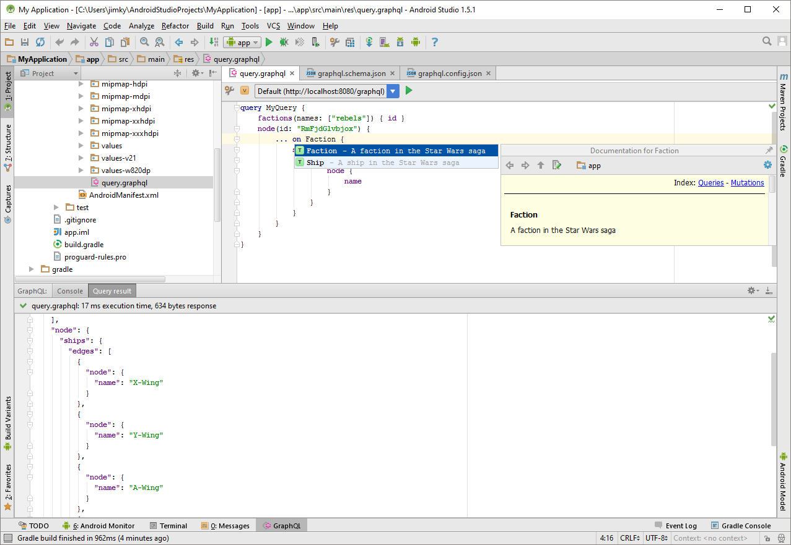

# JS GraphQL IntelliJ Plugin for Android Studio

**Experimental** GraphQL language support for Android Studio.

It provides the following features in IntelliJ IDEA and WebStorm:

- Schema-aware completion and error highlighting
- Syntax highlighting, code-formatting, folding, commenter, and brace-matching
- Configurable GraphQL schema retrieval and reloading based on a local file or a url using 'then-request'
- View and browse the schema documentation in-editor using Ctrl/Cmd+Click or the documentation tool window
- Execute queries with variables against configurable endpoints

It depends on [js-graphql-language-service](https://github.com/jimkyndemeyer/js-graphql-language-service) that it manages using a Node.js process handler.

## Features demo

## FAQ

**Where can I get the plugin?**

The plugin version for Android Studio is currently considered experimental and has not yet been published to the JetBrains Plugin Repository.

Download the [js-graphql-intellij-plugin.jar](android-studio/0.1.0/js-graphql-intellij-plugin.jar) directly from this `android-studio` branch. 

To install it in Android Studio, open "Settings", "Plugins", "Install plugin from disk..."

**How do I reload a GraphQL Schema that was loaded from a URL?**

In the the GraphQL tool window, select the "Console" tab and click the "Restart JS GraphQL Language Service" button. 

## License
MIT
